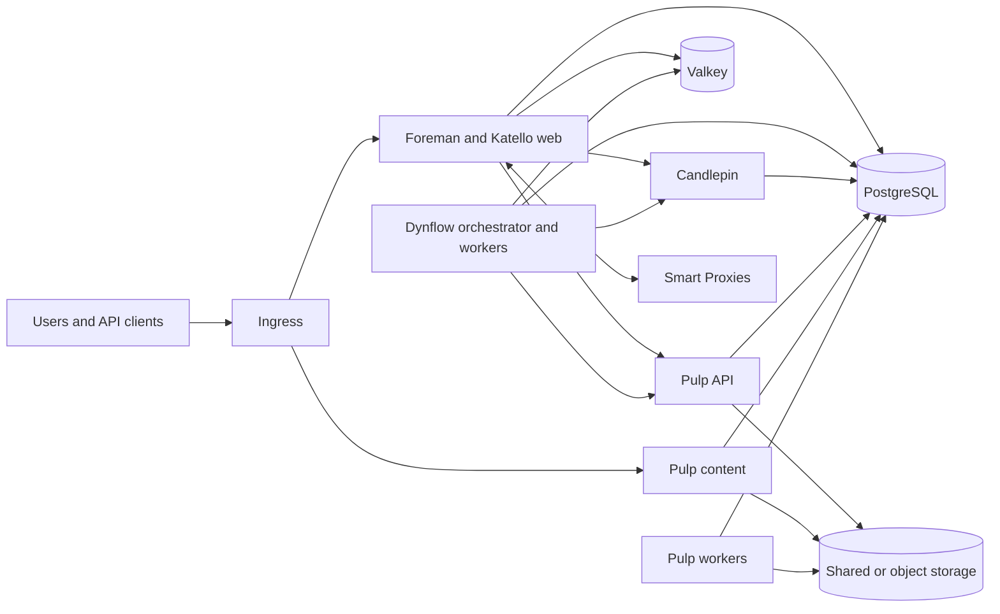

# Architecture

Foreman on Kubernetes composes the official Foreman, Candlepin, and Pulp
containers into one deployment. Katello remains a Foreman plugin, so Foreman
and Katello share the Foreman application workload. Candlepin and Pulp remain
separate services.

## Goals

- deploy existing upstream images without maintaining application forks;
- keep persistent state outside replaceable application pods;
- scale request-serving and worker processes where the upstream runtime allows;
- make singleton limits, migrations, and failure boundaries explicit;
- keep infrastructure-facing services close to the networks they manage; and
- make the same upstream applications work in Kubernetes and traditional
  installations without a runtime mode switch.

## Non-goals

- replacing the application repositories or their release processes;
- rebuilding application images inside this repository;
- hiding PostgreSQL, Valkey, object storage, or backup policy inside the chart;
- moving DHCP, DNS, TFTP, or BMC access into Foreman web pods; or
- claiming high availability by adding replicas to a process that cannot safely
  share ownership.

## Topology

PostgreSQL, Valkey, and Pulp content storage are drawn once for readability.
Production deployments may use separate databases or Valkey instances for
failure isolation and independent lifecycle policies.

## Workloads

### Foreman and Katello

The [Foreman container image](https://github.com/theforeman/foreman-oci-images)
defines which plugins and runtime dependencies it contains. This project treats
that image as one application contract rather than describing Katello as a
separate container.

Foreman web pods can be replicated after configuration, certificates, temporary
handoff data, and other shared state have an explicit external home. Dynflow
uses one orchestrator and separately scalable workers; scaling the web tier must
not implicitly scale task executors.

### Candlepin

Candlepin is a separate Deployment and Service. It is limited to one replica
because its current runtime uses an embedded messaging broker. A pod or node
failure therefore interrupts Candlepin until Kubernetes recreates the pod.
Supporting multiple active replicas requires a tested upstream clustering
contract rather than a chart-only setting.

### Pulp

Pulp exposes separate API, content, and worker processes. API and content pods
can scale independently. Workers are sized separately because their useful
scaling signal is queued work, not incoming HTTP traffic.

All Pulp roles share the same database, credentials, and content store. The
content store can be shared filesystem storage or an S3-compatible object store;
pod-local storage is only scratch space.

### Smart Proxy

Smart Proxies remain independent services. DHCP, DNS, TFTP, BMC, and isolated
provisioning-network access stay on proxies that can reach those networks. A
deployment can register multiple proxies and associate each subnet, location,
or organization with the appropriate one.

Execution-focused proxy workloads may run in Kubernetes when their state,
identity, target-network access, and singleton behavior are explicitly defined.
That does not move network-control features into the Foreman web workload.

## State and lifecycle

Application pods are replaceable; PostgreSQL, Valkey, Pulp content, certificates,
Secrets, and backup data are external contracts. Their availability, backup,
and recovery policies belong to the platform operating those services.

Schema changes run as bounded Jobs before the corresponding application rollout.
An unsuccessful migration stops the rollout; the platform does not automatically
roll back a database after application code has changed it.

## Scaling and availability

A Horizontal Pod Autoscaler (HPA) may scale stateless request-serving pods from
resource or application metrics. Worker scaling should use a workload signal
such as queue depth when available. Singleton processes remain fixed at one
replica, and their lack of high availability is reported as a limitation.

Replicated workloads can use disruption budgets and topology spreading. These
controls preserve already available replicas during maintenance but cannot make
a singleton highly available.

## Ownership

Each upstream project retains its source, tests, release cadence, and image.
Reusable runtime capabilities and fixes are implemented there with traditional
installations preserved. This repository owns Kubernetes resources, deployment
ordering, platform policy, and qualification of compatible published images.
