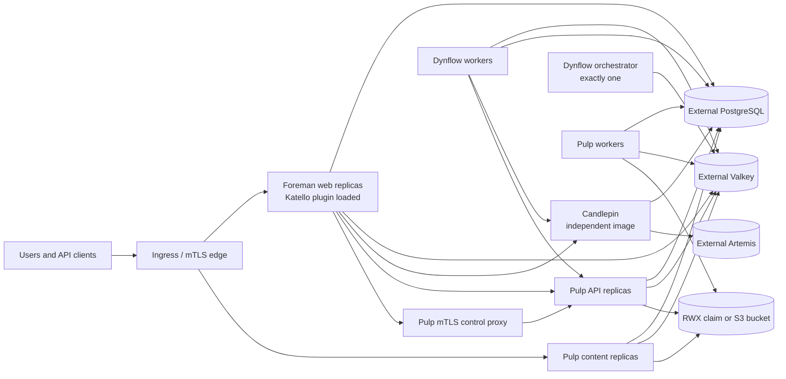

# Architecture

## Ownership model

Application ownership does not move into this repository. Each upstream keeps its own source, tests, release cadence, and image. The orchestration layer pins compatible image versions and translates their public runtime contracts into Kubernetes resources.

The chart may provide Kubernetes probes, recovery tooling, migration ordering,
and one-shot registration orchestration. It must not mount Rails initializers,
Ruby/Python library replacements, JVM agents, or preload hooks into application
code paths. A generally useful runtime capability is implemented in the owning
upstream with its standalone default preserved, then consumed here only after
the compatible official image is pinned.

When NetworkPolicy is enabled, both application and execution releases first
select every one of their pods with a default-deny ingress policy. Additive
component policies then admit only the ingress controller, control-plane peers,
and bounded smoke tests that actually need a listening endpoint. Background
workers and one-shot Jobs therefore remain isolated even though they do not
publish a Service.

## Workload decisions

### Foreman and Katello

Katello is packaged and developed independently, but its runtime is a Foreman Rails plugin. The compatible Foreman image therefore contains both applications. Web replicas are stateless only when database, cache, certificates, and configuration are externalized.

Foreman web replicas can use an `autoscaling/v2` HPA with a stabilization window. CPU is a usable first signal for request-serving pods because every container has a CPU request. Dynflow queue workers use separate opt-in HPAs so web load cannot scale task executors and neither policy can scale the singleton orchestrator.

### Dynflow

The upstream Sidekiq entry point supports distinct queue configurations. Kubernetes uses three Deployments:

- `orchestrator`: always one replica;
- `worker`: horizontally scalable;
- `worker-hosts-queue`: independently scalable for host work.

The two worker Deployments can each use a resource HPA. Their scale-down window
is longer than the web window, and Sidekiq receives the full graceful-shutdown
allowance before Kubernetes kills a removed replica. Keep `minReplicas` above
one when that queue requires a disruption budget during voluntary maintenance.

This preserves the upstream Redis lock and single-orchestrator contract instead of allowing an HPA to scale every process indiscriminately. The chart gives Dynflow its own endpoint contract rather than treating numbered databases on a disposable cache as isolation. A production Dynflow endpoint must be persistent and use `noeviction`; the Foreman cache can use a cache-oriented policy independently.

### Candlepin

Candlepin is a separate Deployment and Service. It defaults to one replica. HA
is accepted only when an external Artemis URL is supplied from a Secret,
embedded messaging is disabled, Quartz's JDBC store is clustered with unique
automatic instance IDs, and chart-owned Liquibase migrations are enabled.

The HA mode protects normal request processing from a pod or node failure. Its
Deployment still uses `Recreate`: migration-before-rollout ordering needs an
operator before the project can claim zero-downtime application/schema
upgrades. The detailed contract is in [`candlepin-ha.md`](candlepin-ha.md).

Before Tomcat is terminated, the Candlepin Pod drains its Service endpoint.
Its termination window explicitly covers the two sequential Artemis client
pool shutdown waits configured by Candlepin, preventing Kubernetes from
cutting the built-in graceful shutdown back to its 30-second default.

### Pulp

Pulp already exposes separate API, content, and worker commands. All three use
the same database, Pulp-specific Valkey endpoint, symmetric key, and content storage. Filesystem mode
requires ReadWriteMany storage so replicas on different nodes see identical
content. S3 mode makes the bucket authoritative and gives every pod only local
scratch space, removing the RWX scheduling and storage dependency.

Pulp runtime pods use a dedicated ServiceAccount. Cloud workload identity can
therefore grant bucket access without extending that authority to Foreman or
Candlepin. Static access keys remain supported through a dedicated Secret, but
are exposed only to the three Pulp runtime roles. The complete boundary is in
[`pulp-object-storage.md`](pulp-object-storage.md).

Pulp API and content Deployments have independent HPAs because their load profiles differ. Pulp workers remain explicitly sized until a queue-depth metric is available; CPU-only worker scaling can add pods after work has already saturated while scaling down active workers prematurely.

Foreman web, Pulp API, and Pulp content pods pause briefly in a `preStop` hook
while Kubernetes removes their endpoint, then receive the server's normal
graceful termination signal. Foreman starts Rails directly as PID 1 so Puma
receives that signal rather than relying on the image's shell-form command.
Pulp passes an explicit Gunicorn graceful timeout, and each Pod termination
window must cover both the endpoint drain and that timeout. This protects
active API requests and content downloads during rollouts and node drains.

Katello discovers Pulp through the `pulp_smart_proxy` endpoint served by Pulp itself. The chart therefore does not add an unrelated Foreman Smart Proxy pod. Instead, a private two-replica NGINX control service requires a trusted client certificate, restricts accepted certificate common names, and injects `REMOTE-USER: admin` before forwarding to Pulp API. A revision Job idempotently registers that endpoint in Foreman after migrations complete.

### Public edge

The optional ingress profile requires ingress-nginx and uses two hostnames.
The release preflight verifies that the selected IngressClass advertises the
`k8s.io/ingress-nginx` controller before making any release change:

- the Foreman hostname sends every path to Foreman and passes verified optional client-certificate headers required by Katello registration;
- the content hostname publishes Pulp content, container, Ansible Galaxy, static asset, and registry paths, but not the administrative `/pulp/api/v3` path.

Pulp certificate guards require the URL-escaped client PEM in `X-CLIENT-CERT`. A dedicated ingress header ConfigMap derives it from NGINX's verified `$ssl_client_escaped_cert` value. Foreman's client-certificate parser accepts that verified URL-escaped PEM form in addition to its existing PEM and base64 DER inputs, so the chart does not inject or replace application authentication code. The matching Foreman settings use the Rack `HTTP_SSL_CLIENT_*` keys. Required certificate annotations win over user-supplied annotations so an ordinary values override cannot disable this trust boundary. The content ingress exposes the Katello-generated file/RPM and ISO paths (`/pulp/content` and the `/pulp/isos` rewrite); container, Debian, and Ansible Galaxy paths are emitted only when their corresponding Pulp plugin is enabled. Standard OCI clients reach the registry at `/v2/`. Katello's compatibility route `/pulpcore_registry/v2/` requires a CA-verified client whose common name is the Foreman host or an explicitly trusted content proxy, maps that identity to Pulp's passwordless remote `admin`, and strips the private prefix before forwarding the request. This matches the established Apache trust boundary without making the administrative `/pulp/api/v3` path public.

Ingress NetworkPolicies make that header trust boundary enforceable. Pulp API accepts traffic only from the mTLS control proxy and the selected ingress controller; the public API-path ingress explicitly removes `REMOTE-USER` and certificate headers. Pulp content and Foreman accept ingress traffic only from the selected controller. Deployments using a differently labelled controller must override `networkPolicy.ingressController`.

### Workload security

#### Kubernetes node operating-system boundary

The operating system inside an application image is distinct from the
operating system of the Kubernetes node. Foreman, Katello, Candlepin, Pulp,
and Smart Proxy package dependencies remain inside their separately released
images. The chart does not install node packages, call the node's init system,
inspect distribution release files, mount container-runtime sockets, or use
application data from the node filesystem.

Normal, migration, registration, recovery, and controller workloads use no
host namespace, `hostPath`, `hostPort`, privileged container, kubelet path, or
container-runtime socket. This makes the deployment independent of whether a
supported Linux node distribution provides RPM or Debian packages for the
applications themselves.

This is not a claim that every cluster is supported automatically. The release
matrix still has to qualify Kubernetes versions, node architectures, container
runtimes, ingress controllers, storage implementations, and host security
integration. The current candidate images are Linux/amd64 only. Smart Proxies
that own DHCP, DNS, TFTP, or another host-integrated edge service remain
outside this node-portability boundary.

Digest-pinned release profiles carry the corresponding
`kubernetes.io/arch` selector into every application, migration, verification,
recurring, recovery, and execution-proxy workload. Environment-specific node
pool selectors are merged with it. A mixed-architecture cluster therefore
keeps the current amd64-only images on compatible nodes without requiring the
operator to duplicate that constraint in deployment values.
The guarded CLI and release operator both verify that every exact workload
node selector has a matching Ready, uncordoned node before they run schema
migrations. The operator receives read-only node-list access solely for this
scheduling preflight. Hard `NoSchedule` and `NoExecute` taints must also be
covered by the rendered workload's tolerations.

The application images already declare non-root users. The chart makes those
contracts explicit: Foreman and Dynflow run as UID/GID 994, Pulp runs as
UID/GID 700, and Candlepin retains the image's `tomcat` identity while requiring
a non-root runtime. Every normal container drops Linux capabilities, disables
privilege escalation, and uses the runtime-default seccomp profile. Runtime,
migration, registration, and recurring-task pods do not mount Kubernetes API
tokens. Only the short-lived recovery ServiceAccount receives a token and its
Secret permissions are constrained to the names included in the encrypted
recovery set.

Read-only root filesystems are enabled only where the current write paths are
fully modelled: the unprivileged Pulp control proxy and recovery toolbox. The
upstream application images still have package-defined cache and temporary
write paths; switching them blindly to read-only would be a reliability change,
so that remains gated on the full image integration test.

Resource requests and memory limits also apply to migration wait containers,
schema Jobs, recurring tasks, Pulp registration, and recovery. These processes
are part of the release or recovery critical path and must remain schedulable
and bounded in namespaces that enforce a LimitRange or ResourceQuota; they use
the budget of the component whose code they execute. Recovery has its own
budget because its database dumps and Restic workload differ from the running
services.

Every Foreman-derived Rails process receives the same `SECRET_KEY_BASE` from a
Secret. The platform does not rely on Foreman's fallback that creates
`tmp/secret_token`: that file-based fallback can race when several Pods start
together and changes after a clean-volume recovery. The Secret is included in
the recovery escrow, while its value never enters a ConfigMap or rendered Helm
manifest.

Ingress isolation is enabled by default. Egress isolation is opt-in because
standard Kubernetes NetworkPolicy cannot select DNS names. When enabled, the
operator must identify PostgreSQL and Valkey by namespace/pod selectors or
CIDRs and list every PostgreSQL listener port in
`networkPolicy.egress.database.ports`. Separate policies then allow only DNS,
declared database and Valkey ports, required in-release service calls, and
explicitly declared external destinations. An optional Secret-backed HTTP(S)
proxy is shared only by Foreman/Katello, Pulp, object-storage verification, and
recovery clients that honor standard proxy environment variables. Its
NetworkPolicy destination is explicit; internal services and metadata
endpoints placed in `NO_PROXY` still require direct rules. Candlepin and its
Artemis connection deliberately remain direct Java/protocol boundaries, and
Candlepin HA requires an explicit Artemis destination. A backup or restore Job
receives its own policy: it can reach DNS, PostgreSQL, the explicitly declared
Kubernetes API endpoint, the optional proxy, and a declared remote Restic
endpoint. The latter rule is omitted for a repository PVC. This avoids leaving
the credential-rich recovery Pod unrestricted and avoids pretending that a
hostname in application configuration can be safely converted into an IP
policy by Helm.

Compute-resource API traffic has its own Foreman-only destination under
`networkPolicy.egress.external.computeProviders`. Provider plugins are rejected
under restricted egress unless that direct destination or the shared outbound
proxy is configured. The rule is omitted when none of the packaged compute
provider plugins is enabled, even if stale peer values remain in a values file.

Disruption budgets protect redundant Foreman, Candlepin, Pulp, Pulp control,
and Dynflow worker pools. They are rendered from the minimum replica count,
including the HPA minimum, and are omitted when a workload is configured as a
singleton. No budget is created for the Dynflow orchestrator or default
single-replica Candlepin: any availability budget on a singleton would block
voluntary node drains without providing actual availability. Redundant
components use `maxUnavailable: 1`, so increasing a deployment from two to
many replicas never weakens the budget to a single surviving pod.

Deployment rollout policy is explicit as well. Request-serving Foreman, Pulp,
and Pulp control-proxy Deployments retain every available replica and add at
most one surge Pod. Background worker pools may replace one replica at a time
and likewise add at most one Pod. Singleton processes whose upstream locking
or event ownership cannot overlap use `Recreate`. This removes Kubernetes'
percentage rounding from the availability contract and bounds temporary node
and database demand during a release.

Topology spread is soft by default so development and single-node clusters can
start. Production profiles can switch it to `DoNotSchedule`; Kubernetes then
refuses to co-locate replicas merely to satisfy capacity, making the requested
node-level failure separation an enforceable scheduling contract.

Readiness checks parse dependency-aware status responses before keeping an
endpoint in traffic, while
separate TCP startup and liveness checks answer a narrower question: whether
the local process has opened and retained its listener. A database, Valkey, or
peer-service outage must not make Kubernetes restart every otherwise healthy
application process and amplify the outage into a restart loop.

Katello's event daemon is a separate singleton Deployment. Katello retains its
standalone lazy-start behavior, while a compatible build also exposes an
explicit foreground runner and configurable runtime directory for supervisors.
All other Foreman-derived workloads therefore default the daemon off; the
dedicated pod is the only process that enables the foreground runner and
publishes a local health heartbeat.
Events remain durable in PostgreSQL while that pod is unavailable.

Recurring Foreman maintenance tasks run as separate CronJobs in an explicit
IANA time zone. Missed starts and total runtime are bounded, and
`concurrencyPolicy: Forbid` prevents overlap. The runtime limit avoids a stuck
task blocking every later schedule indefinitely; each Job also waits for the
Foreman schema migration barrier before loading application code.

Foreman web, Dynflow, event, migration, registration, and cron processes share
an RWX volume at `/usr/share/foreman/tmp`. Katello passes uploaded repository
files and subscription manifests between web requests and asynchronous Dynflow
steps by filesystem path, so pod-local temporary storage would make those
workflows nondeterministically fail. This volume is an operational hand-off
area, not authoritative backup state; maintenance must drain active tasks
before backup or restore.

Puma's control socket directory and `puma.state` are overlaid from a bounded
per-Pod `emptyDir`. Those process-local files cannot be shared by overlapping
web replicas during a rolling update, while all other Katello hand-off paths
remain on the RWX volume.

LDAP avatar bytes are different: Foreman stores only their hash in PostgreSQL
and serves the file from `public/images/avatars`. A second RWX claim keeps those
durable files consistent across web replicas and the recovery workflow includes
it alongside the database snapshot.

The chart also exposes an opt-in-on-invocation Helm test. Its short-lived,
unprivileged Job calls the Foreman/Katello aggregate health endpoint and the
Candlepin and Pulp status endpoints through the same NetworkPolicy boundary as
the application. It validates Candlepin TLS with Foreman's configured CA and
client identity. This proves post-install service wiring and health, not a full
content or provisioning workflow.

## State and upgrades

PostgreSQL, the three role-specific Valkey endpoints, object/shared storage, PKI, Secrets, and the optional
Candlepin Artemis broker are external contracts. This keeps the application
chart usable with existing operators and managed services.

Candlepin, Pulp, and Foreman migrations are release-revision Jobs with bounded
retries. The Foreman migration Job waits until Pulp reports no pending
migrations, preserving their dependency order. Foreman and Pulp application
pods use init containers to wait for their own schema. Candlepin uses its
upstream `HALT` mode and refuses to become healthy while its Liquibase Job has
pending work. If chart migrations are disabled, Candlepin falls back to its
upstream `MANAGE` startup behavior and the schema restricts it to one replica.

The install and upgrade helpers already share and renew a namespaced Lease.
The controller's API and release-phase contract are defined in
[`operator/`](../operator/README.md). They make controller-side Lease adoption,
migration-before-rollout ordering, blocked retries, and the no-database-rollback
boundary machine-testable. Two controller candidates elect one active poller;
the release operation itself remains protected by a separate Lease shared with
the guarded scripts.

Maintenance-gated recovery Jobs stop all application database writers and the
paired execution proxy before making a logical dump of each database and an
encrypted Restic snapshot of application Secrets plus Pulp filesystem storage
when that backend is selected. The same snapshot contains execution Dynflow
and runner state, immutable Ansible content, and execution identity Secrets.
S3 objects remain under the bucket operator's versioning, replication, and
recovery policy. Their lifecycle and external ownership boundaries are defined in
[`disaster-recovery.md`](disaster-recovery.md).

## Network services

DHCP, DNS, TFTP, BMC, and isolated provisioning networks are not moved into the central application pods. Smart Proxies remain edge agents close to those networks. They are not necessarily one fixed machine: a deployment can register multiple proxies and assign each subnet, organization, or location to the proxy that can actually reach it.

The application chart fixes `smartProxy.mode` to `external`. It neither runs the
Smart Proxy process nor exposes infrastructure service ports, host networking,
privileged mode, or Linux capabilities. Functions historically co-located on
an all-in-one Foreman server therefore do not silently move into the Foreman
web container.

A separate `foreman-execution-proxy` chart now models Remote Execution and
Ansible inside Kubernetes. It owns a singleton Smart Proxy process, persistent
Dynflow and runner state, a read-only Ansible content volume, mTLS and SSH
identity mounts, target egress controls, and an exact positive feature
readiness check. Network-control features remain forbidden in that profile.
The namespaced release controller registers this proxy after rollout by
adopting a Foreman Rails Job. It uses Foreman's existing database and mTLS
identity rather than an administrator API credential, and admission requires
that both Foreman's persisted feature associations and the external `/features`
response contain exactly Ansible, Dynflow, and Script. Edge proxies remain
outside this ownership boundary.

The implementation drill is prepared but still unrun against the published
images. It covers proxy registration, the exact feature boundary, successful,
failed, and cancelled SSH jobs, real Ansible commands, declarative role-content
publication, Foreman role sync and assignment, role execution, clean
restoration, explicit allow/deny egress probes, and successful new jobs after
rotating the proxy's server TLS, client TLS, and SSH identities. Smart Proxy
Dynflow still uses SQLite, REx retains process-local job data, and the runners
have no active-job handoff protocol. The schema therefore
fixes the executor to one replica and uses `Recreate`; pretending that a Service
in front of multiple independent executors is HA would lose job ownership
during failure. The detailed contract is in
[`execution-proxy.md`](execution-proxy.md), and plugin placement remains tracked
in [`plugin-compatibility.md`](plugin-compatibility.md).
