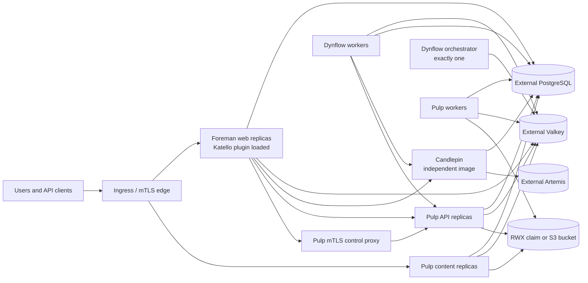

# Architecture

## Ownership model

Application ownership does not move into this repository. Each upstream keeps its own source, tests, release cadence, and image. The orchestration layer pins compatible image versions and translates their public runtime contracts into Kubernetes resources.

## Workload decisions

### Foreman and Katello

Katello is packaged and developed independently, but its runtime is a Foreman Rails plugin. The compatible Foreman image therefore contains both applications. Web replicas are stateless only when database, cache, certificates, and configuration are externalized.

Foreman web replicas can use an `autoscaling/v2` HPA with a stabilization window. CPU is a usable first signal for request-serving pods because every container has a CPU request; queue workers are excluded from this policy.

### Dynflow

The upstream Sidekiq entry point supports distinct queue configurations. Kubernetes uses three Deployments:

- `orchestrator`: always one replica;
- `worker`: horizontally scalable;
- `worker-hosts-queue`: independently scalable for host work.

This preserves the upstream Redis lock and single-orchestrator contract instead of allowing an HPA to scale every process indiscriminately.

### Candlepin

Candlepin is a separate Deployment and Service. It defaults to one replica. HA
is accepted only when an external Artemis URL is supplied from a Secret,
embedded messaging is disabled, Quartz's JDBC store is clustered with unique
automatic instance IDs, and chart-owned Liquibase migrations are enabled.

The HA mode protects normal request processing from a pod or node failure. Its
Deployment still uses `Recreate`: migration-before-rollout ordering needs an
operator before the project can claim zero-downtime application/schema
upgrades. The detailed contract is in [`candlepin-ha.md`](candlepin-ha.md).

### Pulp

Pulp already exposes separate API, content, and worker commands. All three use
the same database, Valkey, symmetric key, and content storage. Filesystem mode
requires ReadWriteMany storage so replicas on different nodes see identical
content. S3 mode makes the bucket authoritative and gives every pod only local
scratch space, removing the RWX scheduling and storage dependency.

Pulp runtime pods use a dedicated ServiceAccount. Cloud workload identity can
therefore grant bucket access without extending that authority to Foreman or
Candlepin. Static access keys remain supported through a dedicated Secret, but
are exposed only to the three Pulp runtime roles. The complete boundary is in
[`pulp-object-storage.md`](pulp-object-storage.md).

Pulp API and content Deployments have independent HPAs because their load profiles differ. Pulp workers remain explicitly sized until a queue-depth metric is available; CPU-only worker scaling can add pods after work has already saturated while scaling down active workers prematurely.

Katello discovers Pulp through the `pulp_smart_proxy` endpoint served by Pulp itself. The chart therefore does not add an unrelated Foreman Smart Proxy pod. Instead, a private two-replica NGINX control service requires a trusted client certificate, restricts accepted certificate common names, and injects `REMOTE-USER: admin` before forwarding to Pulp API. A revision Job idempotently registers that endpoint in Foreman after migrations complete.

### Public edge

The optional ingress profile targets ingress-nginx and uses two hostnames:

- the Foreman hostname sends every path to Foreman and passes verified optional client-certificate headers required by Katello registration;
- the content hostname publishes Pulp content, container, Ansible Galaxy, static asset, and registry paths, but not the administrative `/pulp/api/v3` path.

Pulp certificate guards require the URL-escaped client PEM in `X-CLIENT-CERT`. A dedicated ingress header ConfigMap derives it from NGINX's verified `$ssl_client_escaped_cert` value. The content ingress exposes the Katello-generated file/RPM, container, Debian, and ISO paths (`/pulp/content`, `/pulp/container`, `/pulp/deb`, and the `/pulp/isos` rewrite). The administrative Pulp API remains cluster-internal behind the stricter mTLS control service.

Ingress NetworkPolicies make that header trust boundary enforceable. Pulp API accepts traffic only from the mTLS control proxy and the selected ingress controller; the public API-path ingress explicitly removes `REMOTE-USER` and certificate headers. Pulp content and Foreman accept ingress traffic only from the selected controller. Deployments using a differently labelled controller must override `networkPolicy.ingressController`.

### Workload security

The application images already declare non-root users. The chart makes those
contracts explicit: Foreman and Dynflow run as UID/GID 994, Pulp runs as
UID/GID 700, and Candlepin retains the image's `tomcat` identity while requiring
a non-root runtime. Every normal container drops Linux capabilities, disables
privilege escalation, and uses the runtime-default seccomp profile. Runtime,
migration, registration, and recurring-task pods do not mount Kubernetes API
tokens. Only the short-lived recovery ServiceAccount receives a token and its
Secret permissions are constrained to the names included in the encrypted
recovery set.

Read-only root filesystems are enabled only where the current write paths are
fully modelled: the unprivileged Pulp control proxy and recovery toolbox. The
upstream application images still have package-defined cache and temporary
write paths; switching them blindly to read-only would be a reliability change,
so that remains gated on the full image integration test.

Resource requests and memory limits also apply to migration wait containers,
schema Jobs, recurring tasks, Pulp registration, and recovery. These processes
are part of the release or recovery critical path and must remain schedulable
and bounded in namespaces that enforce a LimitRange or ResourceQuota; they use
the budget of the component whose code they execute. Recovery has its own
budget because its database dumps and Restic workload differ from the running
services.

Ingress isolation is enabled by default. Egress isolation is opt-in because
standard Kubernetes NetworkPolicy cannot select DNS names. When enabled, the
operator must identify PostgreSQL and Valkey by namespace/pod selectors or
CIDRs and list every PostgreSQL listener port in
`networkPolicy.egress.database.ports`. Separate policies then allow only DNS,
declared database and Valkey
ports, required in-release service calls, and explicitly declared Foreman or
Pulp external destinations. Candlepin HA additionally requires an explicit
Artemis destination. This avoids pretending that a hostname in application
configuration can be safely converted into an IP policy by Helm.

Disruption budgets protect redundant Foreman, Candlepin, Pulp, Pulp control,
and Dynflow worker pools. They are rendered from the minimum replica count,
including the HPA minimum, and are omitted when a workload is configured as a
singleton. No budget is created for the Dynflow orchestrator or default
single-replica Candlepin: a `minAvailable: 1` budget on a singleton would block
voluntary node drains without providing actual availability.

HTTP readiness checks keep dependency-aware endpoints out of traffic while
separate TCP startup and liveness checks answer a narrower question: whether
the local process has opened and retained its listener. A database, Valkey, or
peer-service outage must not make Kubernetes restart every otherwise healthy
application process and amplify the outage into a restart loop.

Katello's event daemon is a separate singleton Deployment. Upstream starts it
lazily from Rails middleware and protects it with a PID file on the local
filesystem, which cannot coordinate multiple web pods. All other
Foreman-derived workloads therefore default the daemon off; the dedicated pod
is the only process that enables it and publishes a local health heartbeat.
Events remain durable in PostgreSQL while that pod is unavailable.

Foreman web, Dynflow, event, migration, registration, and cron processes share
an RWX volume at `/usr/share/foreman/tmp`. Katello passes uploaded repository
files and subscription manifests between web requests and asynchronous Dynflow
steps by filesystem path, so pod-local temporary storage would make those
workflows nondeterministically fail. This volume is an operational hand-off
area, not authoritative backup state; maintenance must drain active tasks
before backup or restore.

LDAP avatar bytes are different: Foreman stores only their hash in PostgreSQL
and serves the file from `public/images/avatars`. A second RWX claim keeps those
durable files consistent across web replicas and the recovery workflow includes
it alongside the database snapshot.

The chart also exposes an opt-in-on-invocation Helm test. Its short-lived,
unprivileged Job calls the Foreman/Katello aggregate health endpoint and the
Candlepin and Pulp status endpoints through the same NetworkPolicy boundary as
the application. It validates Candlepin TLS with Foreman's configured CA and
client identity. This proves post-install service wiring and health, not a full
content or provisioning workflow.

## State and upgrades

PostgreSQL, Valkey, object/shared storage, PKI, Secrets, and the optional
Candlepin Artemis broker are external contracts. This keeps the application
chart usable with existing operators and managed services.

Candlepin, Pulp, and Foreman migrations are release-revision Jobs with bounded
retries. The Foreman migration Job waits until Pulp reports no pending
migrations, preserving their dependency order. Foreman and Pulp application
pods use init containers to wait for their own schema. Candlepin uses its
upstream `HALT` mode and refuses to become healthy while its Liquibase Job has
pending work. If chart migrations are disabled, Candlepin falls back to its
upstream `MANAGE` startup behavior and the schema restricts it to one replica.

The future controller's namespaced API and release-phase contract are defined
in [`operator/`](../operator/README.md). They make Lease acquisition,
migration-before-rollout ordering, blocked retries, and the no-database-rollback
boundary machine-testable without claiming that a controller is running yet.

Maintenance-gated recovery Jobs stop all database writers before making a
logical dump of each database and an encrypted Restic snapshot of application
Secrets plus Pulp filesystem storage when that backend is selected. S3 objects
remain under the bucket operator's versioning, replication, and recovery
policy. Their lifecycle and external ownership boundaries are defined in
[`disaster-recovery.md`](disaster-recovery.md).

## Network services

DHCP, DNS, TFTP, BMC, and isolated provisioning networks are not moved into the central application pods. Smart Proxies remain edge agents close to those networks. They are not necessarily one fixed machine: a deployment can register multiple proxies and assign each subnet, organization, or location to the proxy that can actually reach it.

The application chart fixes `smartProxy.mode` to `external`. It neither runs the
Smart Proxy process nor exposes infrastructure service ports, host networking,
privileged mode, or Linux capabilities. Functions historically co-located on
an all-in-one Foreman server therefore do not silently move into the Foreman
web container.

A separate `foreman-execution-proxy` chart now models Remote Execution and
Ansible inside Kubernetes. It owns a singleton Smart Proxy process, persistent
Dynflow and runner state, a read-only Ansible content volume, mTLS and SSH
identity mounts, target egress controls, and an exact positive feature
readiness check. Network-control features remain forbidden in that profile.

The implementation drill is prepared but still unrun against the published
images. It covers proxy registration, the exact feature boundary, successful,
failed, and cancelled SSH jobs, real Ansible commands, declarative role-content
publication, Foreman role sync and assignment, role execution, clean
restoration, explicit allow/deny egress probes, and successful new jobs after
rotating the proxy's server TLS, client TLS, and SSH identities. Smart Proxy
Dynflow still uses SQLite, REx retains process-local job data, and the runners
have no active-job handoff protocol. The schema therefore
fixes the executor to one replica and uses `Recreate`; pretending that a Service
in front of multiple independent executors is HA would lose job ownership
during failure. The detailed contract is in
[`execution-proxy.md`](execution-proxy.md), and plugin placement remains tracked
in [`plugin-compatibility.md`](plugin-compatibility.md).
