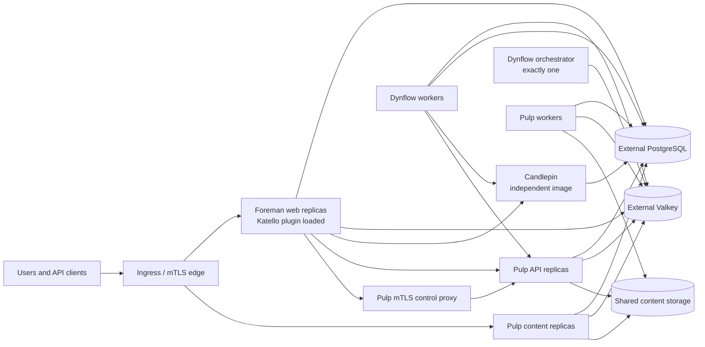

# Architecture

## Ownership model

Application ownership does not move into this repository. Each upstream keeps its own source, tests, release cadence, and image. The orchestration layer pins compatible image versions and translates their public runtime contracts into Kubernetes resources.

## Workload decisions

### Foreman and Katello

Katello is packaged and developed independently, but its runtime is a Foreman Rails plugin. The compatible Foreman image therefore contains both applications. Web replicas are stateless only when database, cache, certificates, and configuration are externalized.

Foreman web replicas can use an `autoscaling/v2` HPA with a stabilization window. CPU is a usable first signal for request-serving pods because every container has a CPU request; queue workers are excluded from this policy.

### Dynflow

The upstream Sidekiq entry point supports distinct queue configurations. Kubernetes uses three Deployments:

- `orchestrator`: always one replica;
- `worker`: horizontally scalable;
- `worker-hosts-queue`: independently scalable for host work.

This preserves the upstream Redis lock and single-orchestrator contract instead of allowing an HPA to scale every process indiscriminately.

### Candlepin

Candlepin is a separate Deployment and Service. Phase 1 uses `Recreate` and one replica because startup currently manages database migrations, Artemis is embedded by default, and Quartz clustering is not enabled in the foremanctl configuration.

Future HA requires a shared Artemis service, stable unique node names, Quartz JDBC clustering, and a migration/scheduler ownership decision. Until those changes are verified upstream, accepting `replicas > 1` would be misleading.

### Pulp

Pulp already exposes separate API, content, and worker commands. All three use the same database, Valkey, symmetric key, and content storage. The chart requires ReadWriteMany storage so replicas on different nodes see identical content.

Pulp API and content Deployments have independent HPAs because their load profiles differ. Pulp workers remain explicitly sized until a queue-depth metric is available; CPU-only worker scaling can add pods after work has already saturated while scaling down active workers prematurely.

Katello discovers Pulp through the `pulp_smart_proxy` endpoint served by Pulp itself. The chart therefore does not add an unrelated Foreman Smart Proxy pod. Instead, a private two-replica NGINX control service requires a trusted client certificate, restricts accepted certificate common names, and injects `REMOTE-USER: admin` before forwarding to Pulp API. A revision Job idempotently registers that endpoint in Foreman after migrations complete.

### Public edge

The optional ingress profile targets ingress-nginx and uses two hostnames:

- the Foreman hostname sends every path to Foreman and passes verified optional client-certificate headers required by Katello registration;
- the content hostname publishes Pulp content, container, Ansible Galaxy, static asset, and registry paths, but not the administrative `/pulp/api/v3` path.

Pulp certificate guards require the URL-escaped client PEM in `X-CLIENT-CERT`. A dedicated ingress header ConfigMap derives it from NGINX's verified `$ssl_client_escaped_cert` value. The administrative Pulp API remains cluster-internal behind the stricter mTLS control service.

Ingress NetworkPolicies make that header trust boundary enforceable. Pulp API accepts traffic only from the mTLS control proxy and the selected ingress controller; the public API-path ingress explicitly removes `REMOTE-USER` and certificate headers. Pulp content and Foreman accept ingress traffic only from the selected controller. Deployments using a differently labelled controller must override `networkPolicy.ingressController`.

## State and upgrades

PostgreSQL, Valkey, object/shared storage, PKI, and Secrets are external contracts. This keeps the first application chart usable with existing operators and managed services.

Pulp and Foreman migrations are release-revision Jobs with bounded retries. The Foreman migration Job waits until Pulp reports no pending migrations, preserving their dependency order. Application pods use init containers to wait for their own schema, so Helm can create configuration, Jobs, and workloads in one release without a pre-install hook referencing a ConfigMap that does not exist yet. Candlepin retains its upstream startup migration behavior while it is single-replica.

## Network services

DHCP, DNS, TFTP, BMC, and isolated provisioning networks are not moved into the central application pods. Smart Proxies remain edge agents close to those networks. A later chart will manage proxy registration and credentials without requiring the Kubernetes cluster to bridge every provisioning VLAN.
