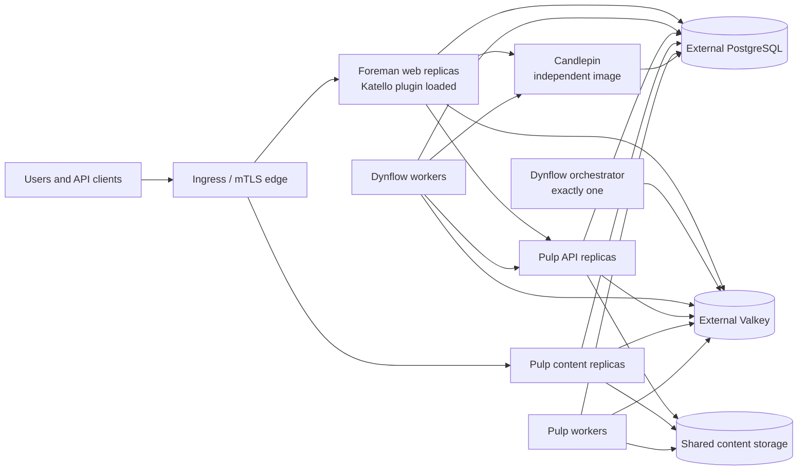

# Architecture

## Ownership model

Application ownership does not move into this repository. Each upstream keeps its own source, tests, release cadence, and image. The orchestration layer pins compatible image versions and translates their public runtime contracts into Kubernetes resources.

## Workload decisions

### Foreman and Katello

Katello is packaged and developed independently, but its runtime is a Foreman Rails plugin. The compatible Foreman image therefore contains both applications. Web replicas are stateless only when database, cache, certificates, and configuration are externalized.

### Dynflow

The upstream Sidekiq entry point supports distinct queue configurations. Kubernetes uses three Deployments:

- `orchestrator`: always one replica;
- `worker`: horizontally scalable;
- `worker-hosts-queue`: independently scalable for host work.

This preserves the upstream Redis lock and single-orchestrator contract instead of allowing an HPA to scale every process indiscriminately.

### Candlepin

Candlepin is a separate Deployment and Service. Phase 1 uses `Recreate` and one replica because startup currently manages database migrations, Artemis is embedded by default, and Quartz clustering is not enabled in the foremanctl configuration.

Future HA requires a shared Artemis service, stable unique node names, Quartz JDBC clustering, and a migration/scheduler ownership decision. Until those changes are verified upstream, accepting `replicas > 1` would be misleading.

### Pulp

Pulp already exposes separate API, content, and worker commands. All three use the same database, Valkey, symmetric key, and content storage. The chart requires ReadWriteMany storage so replicas on different nodes see identical content.

## State and upgrades

PostgreSQL, Valkey, object/shared storage, PKI, and Secrets are external contracts. This keeps the first application chart usable with existing operators and managed services.

Pulp migrations run before Foreman migrations on install and upgrade. Both are Helm hook Jobs with bounded retries. Candlepin retains its upstream startup migration behavior while it is single-replica.

## Network services

DHCP, DNS, TFTP, BMC, and isolated provisioning networks are not moved into the central application pods. Smart Proxies remain edge agents close to those networks. A later chart will manage proxy registration and credentials without requiring the Kubernetes cluster to bridge every provisioning VLAN.
